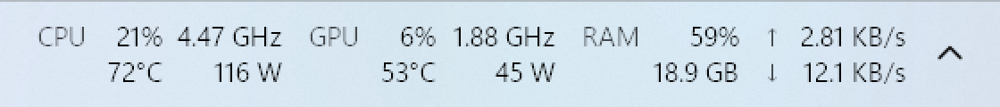
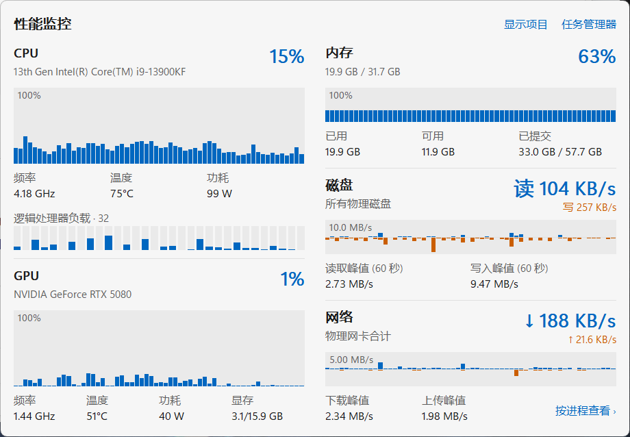
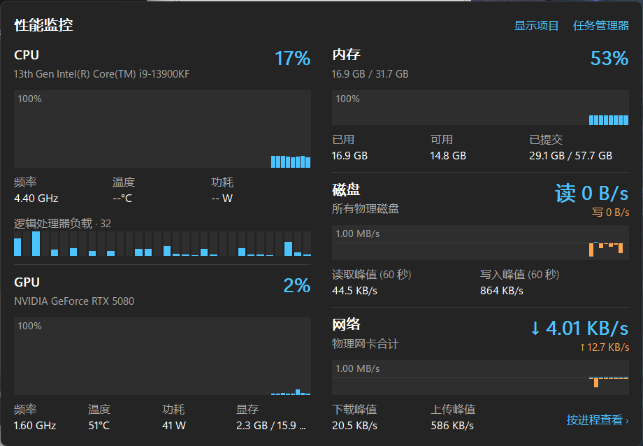
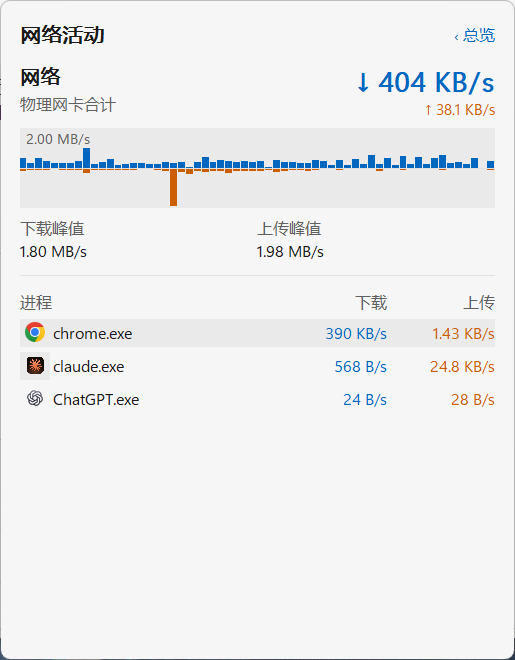
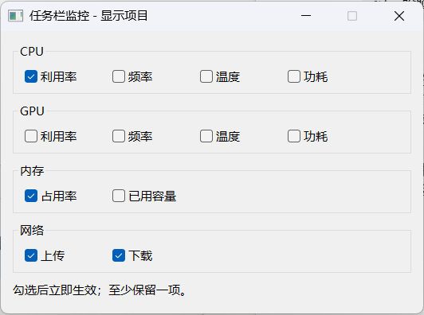

<p align="center">
  
</p>

<h1 align="center">TaskbarMonitor</h1>

<p align="center">
  A tiny, native system monitor that lives <b>inside the Windows 11 taskbar</b>, right next to the notification area.<br>
  <b>English</b> | <a href="README.zh-CN.md">简体中文</a>
</p>



TaskbarMonitor shows CPU, GPU, memory and network figures in the empty space just left of the tray's `^` button and refreshes them once per second. Click it for a Windows 11–style flyout with 60-second history charts, or click the network figures to see which programs are using your bandwidth.

It is a single ~115 KB executable written in plain C++/Win32. At idle it uses about 0.006% of the CPU and a few MB of RAM.

> The user interface is in Simplified Chinese.

## Features

- **Taskbar strip:** CPU utilization, clock, package temperature and power; GPU utilization, clock, temperature and board power; RAM usage; upload and download speed. Every item can be turned on or off individually, and the strip shrinks to fit what is shown.
- **Details flyout (left click):** two columns covering CPU (including the load of every logical processor), GPU (including VRAM), memory (including commit charge), disk read/write and network. Each has a 60-second history chart. The flyout follows the system light/dark theme and accent color.
- **Per-process network view (click the network figures):** download and upload ranking per program. Processes running the same executable are merged, e.g. `chrome.exe (5)`.
- **Gets out of the way:** when task buttons fill the taskbar, the strip gives up whole groups (GPU → memory → network → CPU) and finally hides. It comes back by itself once there is room. It also avoids the Widgets button on left-aligned taskbars.
- **Tray icon:** left click opens the flyout, right click opens the menu with Exit. You can always reach it, even while the strip is hidden.
- **Theme and layout aware:** follows light/dark mode, DPI changes, tray width changes, and Explorer restarts.
- **Start with Windows:** when running elevated, this creates a "highest privileges" logon task, so temperature and power work at sign-in without a UAC prompt.

| Overview (light) | Overview (dark) |
|---|---|
|  |  |

| Network activity per program | Display items |
|---|---|
|  |  |

When the taskbar runs out of room, the strip collapses instead of covering task buttons. Top image: normal. Bottom image: 17 extra windows open, so the GPU group has been given up.


## Requirements

- Windows 11 (the strip attaches to the primary monitor's taskbar), x64
- Optional, for **CPU temperature and power**: the [PawnIO](https://pawnio.eu/) driver and running as administrator. Intel CPUs only for now.
- Optional, for **per-process network usage**: running as administrator
- GPU metrics: an NVIDIA GPU with a current driver (uses NVML, which ships with the driver)

## Getting started

1. Download `TaskbarMonitor.exe` from [`release/`](release/) or from the Releases page. Nothing to install.
2. Run it. The strip appears left of the tray's `^` button.
3. For CPU temperature and power:
   1. Install [PawnIO](https://github.com/namazso/PawnIO.Setup/releases/latest).
   2. Right-click the strip and choose **以管理员身份重启** (restart as administrator).
   3. Tick **开机自动启动** (start with Windows) while elevated, so it starts that way at every sign-in without a prompt.

| Action | Result |
|---|---|
| Left click the strip | Details flyout; click outside or press Esc to close |
| Left click the network figures | Per-process network flyout |
| Right click the strip or tray icon | Menu: details, Task Manager, display items, start with Windows, exit |
| `TaskbarMonitor.exe /show` | Toggle the details flyout of the running instance (bind it to a hotkey) |
| `TaskbarMonitor.exe /show network` | Toggle the network flyout |
| `TaskbarMonitor.exe /replace` | Replace a running instance (also an elevated one) with this executable |

Display-item choices are stored in `HKCU\Software\TaskbarMonitor`.

## Resource usage

Measured on an i9-13900KF / RTX 5080, Windows 11 build 26200:

| Situation | CPU (one core / whole CPU) |
|---|---|
| Normal (flyout closed) | ≈ 0.18% / 0.006% |
| Details flyout open | ≈ 0.8% / 0.02% |
| Network flyout open during a ~40 MB/s download | ≈ 0–3% of one core, only while open |

- **Memory:** 2–9 MB in Task Manager's memory column (private working set). Commit is about 29–37 MB, of which about 20 MB is reserved by NVIDIA's `nvml.dll` and stays mostly untouched.
- **Leak test:** the details and network flyouts were opened and closed alternately 200 times, including 100 ETW session start/stops. After the first open, commit stayed at 36.3–36.7 MB, with 478 handles, 18 GDI objects and 26 USER objects throughout. No ETW session was left behind.

## How it works

- **Placement:** Windows 11 removed taskbar toolbars (DeskBands). The strip is therefore a layered child window of `Shell_TrayWnd`, aligned to the real rectangle of `TrayNotifyWnd`. This is the same idea as [TrafficMonitor](https://github.com/zhongyang219/TrafficMonitor), including its fix for touch devices, where the taskbar window is taller than the visible bar.
- **Crowding detection:** Windows 11 task buttons are XAML elements without HWNDs. The `MSTaskSwWClass` rectangle no longer matches them, so their real bounds are read through UI Automation (`TaskbarFrame` children). The query runs on the sampling thread (COM MTA), and only after shell-hook window create/destroy notifications, settings or display changes, or tray width changes, plus a 30-second safety refresh.
- **Sensors:**
  - **CPU load and clock:** PDH, the same counters Task Manager uses.
  - **CPU temperature and power:** `IA32_PACKAGE_THERM_STATUS` and the RAPL `PKG_ENERGY_STATUS` MSRs, read through the maintained, signed [PawnIO](https://pawnio.eu/) driver instead of the WinRing0 driver that Defender flags.
  - **GPU:** NVML.
  - **Network totals:** `GetIfTable2`, physical adapters only, so filter drivers and virtual switches are not counted twice.
  - **Disk:** PDH `PhysicalDisk(_Total)`.
- **Per-process network:** a private real-time ETW session on `Microsoft-Windows-Kernel-Network`, the same source Resource Monitor uses. It filters by event ID in the kernel, skips loopback traffic, and runs only while the network flyout is open.
- **Rendering:** GDI only, with no Direct2D or XAML runtime loaded.
  - The strip draws grayscale-antialiased text in the polarity it will be shown in, then pushes it as per-pixel alpha via `UpdateLayeredWindow`, using the taskbar clock's font (Segoe UI Variable).
  - The flyout is double-buffered, with ClearType text, bar charts, and DWM rounded corners and shadow.
- **Threads:** the UI thread only draws. Its windows share Explorer's input queue, so anything slow (sampling, UI Automation, `schtasks`, UAC prompts) runs elsewhere.

## Building

You need [LLVM-MinGW](https://github.com/mstorsjo/llvm-mingw) (`winget install MartinStorsjo.LLVM-MinGW.UCRT`). No Visual Studio is required.

```powershell
.\build.ps1      # -> bin\TaskbarMonitor.exe
.\package.ps1    # -> release\TaskbarMonitor.exe and release\TaskbarMonitor-<version>-win-x64.zip
```

`res\make_icon.ps1` regenerates `res\app.ico`, drawing every size natively so the 16–24 px icons stay sharp.

## Repository layout

```
├─ src/                    C++ sources
│  ├─ main.cpp             taskbar strip, tray icon, menu, settings window, sampling thread
│  ├─ panel.cpp            details / network flyout
│  ├─ metrics.cpp          PDH, NVML, memory, network, PawnIO sensors
│  ├─ netproc.cpp          per-process network (ETW)
│  ├─ tbspace.cpp          taskbar occupancy (UI Automation)
│  └─ pawnio.cpp, format.cpp, *.h
├─ res/                    icon, manifest, resource script, icon generator
├─ third_party/
│  └─ pawnio-modules/      signed IntelMSR module (LGPL-2.1) and its license
├─ docs/images/            screenshots used by the readmes
├─ release/                prebuilt executable and zip
├─ build.ps1, package.ps1
└─ README.md, README.zh-CN.md, CHANGELOG.md, LICENSE
```

## Limitations

- The strip only attaches to the taskbar on the primary monitor.
- CPU temperature and power are implemented for Intel CPUs only.
- GPU metrics need an NVIDIA GPU.
- The UI is Simplified Chinese only.

## Acknowledgements

- [TrafficMonitor](https://github.com/zhongyang219/TrafficMonitor), for proving the in-taskbar approach on Windows 11.
- [PawnIO](https://pawnio.eu/) and [PawnIO.Modules](https://github.com/namazso/PawnIO.Modules) by namazso.

## License

[MIT](LICENSE) for the TaskbarMonitor source code. The embedded PawnIO module in [`third_party/pawnio-modules`](third_party/pawnio-modules) is licensed under LGPL-2.1-or-later.
